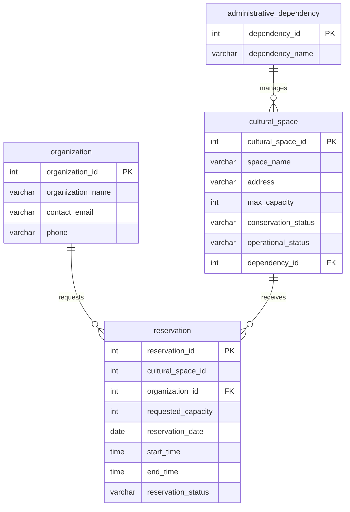

# Modelo entidad-relación (inferido del código original)

El vínculo `reservation.cultural_space_id` cruza las bases `db_reservas` y `db_patrimonio` y se valida en la aplicación. Este modelo se infiere de las consultas del repositorio: no constituye evidencia de que el esquema original del profesor tenga exactamente estos tipos o restricciones.
